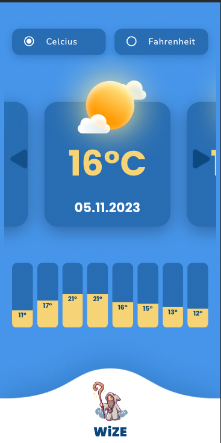

# Wize App

Wize app is an app that shows a 5 days weather forecast for a particular location. You can see the live demo [here](https://wize-app.vercel.app/).

## Getting Started

- Clone the GitHub repository.
- Execute `yarn` or `npm install` to install all necessary dependencies.
- Copy the `.env.example` file and rename the copy to `.env`.
- Populate the `VITE_API_KEY` variable within the `.env` file with your OpenWeather API key.
- Launch the application in development mode by running `yarn dev` or `npm run dev`.
